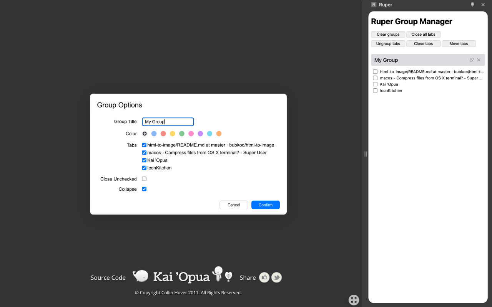

# Ruper - Manage your tab groups easily

> **Saved tab groups are uneditable.**

## Install

1. Download the repository to your computer
2. Open developer mode in chrome://extensions
3. Use "Load Unpacked" and select the repository folder

## Usage

### Create/Edit group

**Shortcut: `Ctrl + g`**

This will bring the group options dialog to the front. Once you're done, hit `Enter` or confirm button to create a tab group or add selected tabs to an existing tab group.

You can also transfer tabs in current group to another group.

### Cancel group

**Shortcut: `Ctrl + u`**

Cancel current tab group.

### Ungroup current tab

**Shortcut: `Ctrl + Shift + u`**

Remove current tab from the tab group.

## Side Panel

You can open a side panel by clicking on the extension's icon.

### Clear groups

Cancel all groups, but keep the tabs open.

### Close all tabs

Cancel all groups, and close all the tabs.

### Ungroup tabs

Remove the selected tabs from its own group.

### Close tabs

Remove the selected tabs from its own group and close these tabs.

### Move tabs

Move the selected tabs to another group.

### Group operations

- **disconnect**: cancel current group
- **close**: cancel current group and close tabs in this group

## License

The scripts and documentation in this project are released under the [MIT License](./LICENSE)
